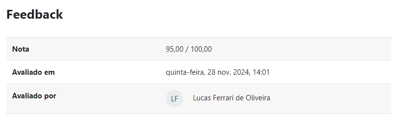
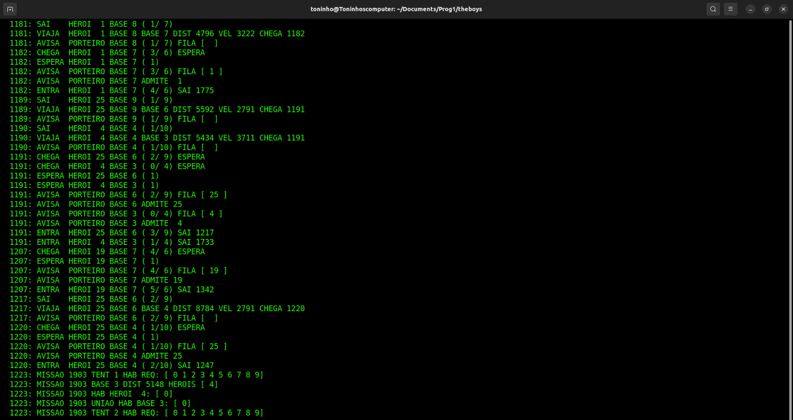
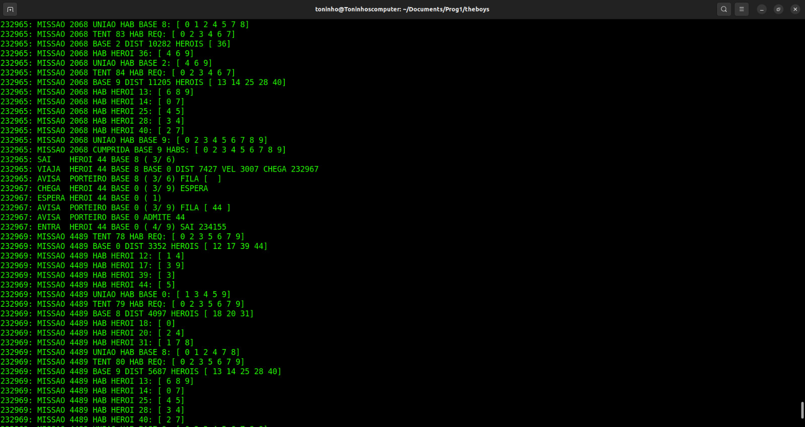
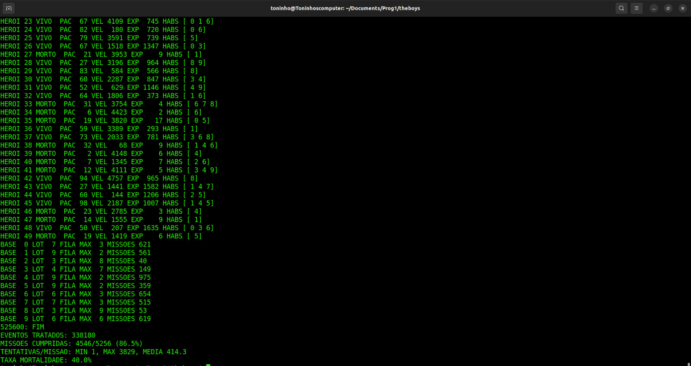

# The Boys
## Desenvolvido na disciplina de Programação 1 (Developed in the Programming 1 course).
## Antonio da Ressurreição Filho, student in the second semester of Computer Science at the Federal University of Paraná (UFPR).
## Professors: [Dr. Carlos A. Maziero](https://wiki.inf.ufpr.br/maziero/doku.php?id=start) and [Dr. Lucas Ferrari de Oliveira](https://web.inf.ufpr.br/lferrari/)

"Mares calmos não fazem bons marinheiros" - Max Fercondini.

## Português:

O trabalho foi desenvolvido segundo as especificações contidas no site do docente Doutor Carlos A. Maziero, em que observa-se a ideia central de todo o 
projeto e sabe-se, a partir dessa página da internet, como o trabalho deve funcionar. (AS ESPECIFICAÇÕES ESTÃO SOMENTE EM PORTUGUÊS).
[ESPECIFICAÇÕES DO TRABALHO](https://wiki.inf.ufpr.br/maziero/doku.php?id=c:theboys)

A maioria dos arquivos contidos nesse trabalho têm a extensão ".c", que contém a implementação do código, e a extensão ".h", que consiste no esqueleto do código.
O objetivo do arquivo de extenção ".h" é permitir que as funções implementadas no arquivo ".c" sejam chamadas em outros arquivos do projeto por meio das configurações 
corretas feitas no arquivo "makefile".

***Arquivos "conjunto.h" e "conjunto.o":***

Esses dois arquivos foram elaborados pelo docente Dr. Carlos A. Maziero. Na extensão ".h" está o cabeçalho de todas as funções contidas em um arquivo de extensão ".c",
o qual consiste em um Tipo Abstrato de Dados (TAD) Conjunto de números inteiros. Como já tem-se a extensão ".o" do arquivo, isto é, o executável que o compilador
usa para executar o programa, não precisa-se da extenção ".c". Esses arquivos foram usados em diversos trechos do projeto The Boys em busca de facilitar tanto a compreenção
quanto a dificuldade exigida pelo trabalho.

***Arquivos "lista.c", "lista.h", "fprio.c" e "fprio.h":***

Esses arquivos foram desenvolvidos anteriormente em sala de aula e corrigidos antes de se começar o The Boys. Os arquivos "lista.h" e "fprio.h" foram desenvolvidos pelo 
docente Dr. Carlos A. Maziero, tendo como objetivo dos trabalhos somente a criação dos arquivos ".c" pelos discentes. O arquivo "lista.c" consiste em um Tipo Abstrato de
Dados (TAD) Lista de números inteiros e o arquivo "fprio.c" consiste em um Tipo Abstrato de Dados (TAD) Lista de Prioridades. Essas duas listas foram de fundamental 
importância na elaboração do projeto The Boys. 
Notas que eu, Antonio da Ressurreição Filho, recebi nesses dois trabalhos pelo docente Dr. Lucas Ferrari de Oliveira:

**Lista.c:**

O 5 pontos perdidos foram por causa da identação errada em alguns trechos do código e um erro específico em uma saída, o qual foi consertado imediatamente após o recebimento 
da nota.

**Fprio.c:**

Recebi 100, nota máxima.

***Arquivo "Entidades.h":***

Esse arquivo contêm as estruturas principais do meu programa, as quais são feitas usando o tipo de estruturas de dados da linguagem C chamadas "structs",em que consegue-se 
a partir delas criar variáveis sob um mesmo tipo de dado. Ademais, todas as estruturas criadas em tal arquivo foram inspiradas nas especificações do trabalho no site do 
docente Doutor Carlos A. Maziero.

***Arquivos "cria_mundo.c" e "cria_mundo.h":***

Nesses arquivos há a criação de uma função que inicializa o mundo de heróis, bases e missões. Seguindo as especificações do trabalho, atribui a cada herói, base e missão
seus respectivos valores, com a ajuda também da função "aleat" que está contida nos arquivos "funcoes_sec.c" e funcoes_sec.h", que consiste basicamente no sorteio aleatório
de números entre um intervalo (a, b).

***Arquivos "destroi_mundo.c" e "destroi_mundo.h":***

Nesses arquivos foram feitas as liberações de memórias alocadas criadas nos arquivos "cria_mundo.c" e "cria_mundo.h", a fim de não haver nenhuma memória vazada após a execução
do programa The Boys.

***Arquivos "funcoes_sec.c" e "funcoes_sec.h":***

Esses arquivos foram criados para que houvesse uma maior organização no projeto The Boys. Neles, há funções que são usadas secundariamente em outros arquivos do projeto, como a
função aleat mencionada anteriormente. Além disso, há também nesses arquivos as funções que criam e inserem novos eventos na minha Lista de Eventos Futuros (que consiste em um 
TAD Lista de Prioridade) e os prints das funções criadas no arquivo "eventos.c".

***Arquivos "chamando_lef.c" e "chamando_lef.h":***

Esses arquivos implementam uma função que leia o primeiro item da Lista de Eventos Futuros (que consiste em um TAD Lista de Prioridade), chama a respectiva função (dependendo do
evento que esse item for) e após executar o evento libera esse evento para desalocar memória alocada anteriormente.

***Arquivos "eventos.c" e "eventos.h":***

Esses arquivos são responsáveis pelas principais funções do projeto TheBoys, as quais consistem basicamente no que cada evento fará quando chamado pela Lista de Eventos Futuros, com
suas devidas modificações em eventos atuais, prints para o usuário e criações de eventos futuros.

***Arquivo "makefile":***

Esse arquivo direciona o make sobre como compilar o programa e também vincula todos os arquivos citados dentro dele, com suas extensões ".c", ".o" e ".h".

***Arquivo "theboys.c":***

Esse é o meu arquivo principal, o qual chama todos os arquivos anteriormente criados. Esse arquivo chama a função cria_mundo, ev_iniciais, chamando_lef e destroi_mundo respectivamente.

### Imagens do programa sendo executado:

- Estatísticas no começo:

- Estatísticas no meio:

- Estatísticas finais 1:

- Estatísticas finais 2:

### Nota do trabalho final da disciplina de Programação 1 dada pelo docente Dr. Lucas Ferrari de Oliveira para o discente Antonio da Ressurreição Filho:

## English:

This project was developed following the specifications provided on the website of Dr. Carlos A. Maziero. These specifications outline the central idea of the project and provide guidance on how the work should function. (SPECIFICATIONS ARE ONLY AVAILABLE IN PORTUGUESE).  
[PROJECT SPECIFICATIONS](https://wiki.inf.ufpr.br/maziero/doku.php?id=c:theboys)

Most of the files in this project have a ".c" extension, which contains the code implementation, and a ".h" extension, which serves as the code skeleton.  
The purpose of the ".h" file is to allow the functions implemented in the ".c" file to be called in other project files through the correct configurations defined in the "makefile".

***Files "conjunto.h" and "conjunto.o":***

These two files were provided by Dr. Carlos A. Maziero. The ".h" file contains the headers of all functions defined in a corresponding ".c" file, which implements an Abstract Data Type (ADT) called Set of integers.  
Since the project already includes the ".o" file (the compiled object file used by the compiler to execute the program), the ".c" file is not required. These files were used in various parts of the project The Boys to simplify comprehension and address the complexity required in the project.

***Files "lista.c", "lista.h", "fprio.c", and "fprio.h":***

These files were developed earlier during class and corrected before starting The Boys project.  
The "lista.h" and "fprio.h" files were created by Dr. Carlos A. Maziero, while the objective for the students was to implement only the ".c" files.  
The "lista.c" file represents an Abstract Data Type (ADT) for a List of integers, while the "fprio.c" file implements an Abstract Data Type (ADT) for a Priority Queue.  
These two ADTs were fundamental in the development of The Boys project.  
Grades I, Antonio da Ressurreição Filho, received for these assignments from Dr. Lucas Ferrari de Oliveira:

**Lista.c:**

The 5-point deduction was due to incorrect indentation in some parts of the code and a specific error in the output, which was immediately corrected after receiving the grade.

**Fprio.c:**

I received 100, the maximum grade.

***File "Entidades.h":***

This file contains the main structures of my program, which are implemented using the "struct" data structure in C. These structures allow the creation of variables under a unified data type.  
Additionally, all the structures defined in this file were inspired by the project specifications available on Dr. Carlos A. Maziero's website.

***Files "cria_mundo.c" and "cria_mundo.h":***

These files implement a function that initializes the world of heroes, bases, and missions. Following the project specifications, each hero, base, and mission is assigned its respective values, with the help of the "aleat" function located in the files "funcoes_sec.c" and "funcoes_sec.h".  
The "aleat" function generates random numbers within a specified range (a, b).

***Files "destroi_mundo.c" and "destroi_mundo.h":***

These files handle the memory deallocation for resources created in "cria_mundo.c" and "cria_mundo.h", ensuring that no memory leaks occur after the execution of The Boys program.

***Files "funcoes_sec.c" and "funcoes_sec.h":***

These files were created to improve the organization of The Boys project. They contain functions that are used as secondary utilities in other parts of the project, such as the previously mentioned "aleat" function.  
Additionally, these files include functions for creating and inserting new events into my Future Event List (implemented as a Priority Queue ADT) and print functions for displaying information from "eventos.c".

***Files "chamando_lef.c" and "chamando_lef.h":***

These files implement a function that reads the first item from the Future Event List (a Priority Queue ADT), executes the corresponding function (based on the event type), and then frees the memory allocated for that event.

***Files "eventos.c" and "eventos.h":***

These files contain the main functions of The Boys project, which define the behavior of each event when called from the Future Event List.  
These functions handle modifications to current events, user-facing outputs, and the creation of future events.

***File "makefile":***

This file directs the `make` utility on how to compile the program and links all the necessary files, including those with extensions ".c", ".o", and ".h".

***File "theboys.c":***

This is the main file of the project, which calls all previously created files.  
The functions called in this file include `cria_mundo`, `ev_iniciais`, `chamando_lef`, and `destroi_mundo`, in this respective order.

### Images of the program in execution:

- Initial statistics:  

- Midway statistics:  

- Final statistics 1:  

- Final statistics 2:  

### Final grade for the Programming 1 project given by Dr. Lucas Ferrari de Oliveira to Antonio da Ressurreição Filho:

 
